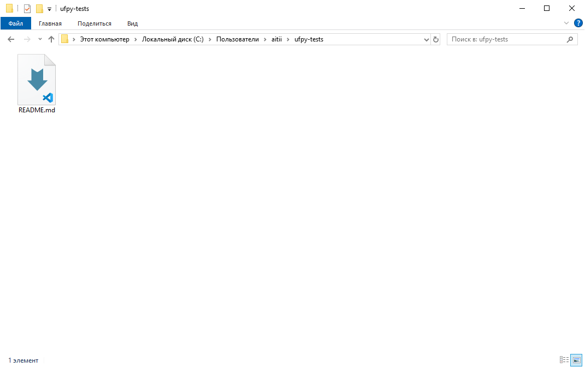
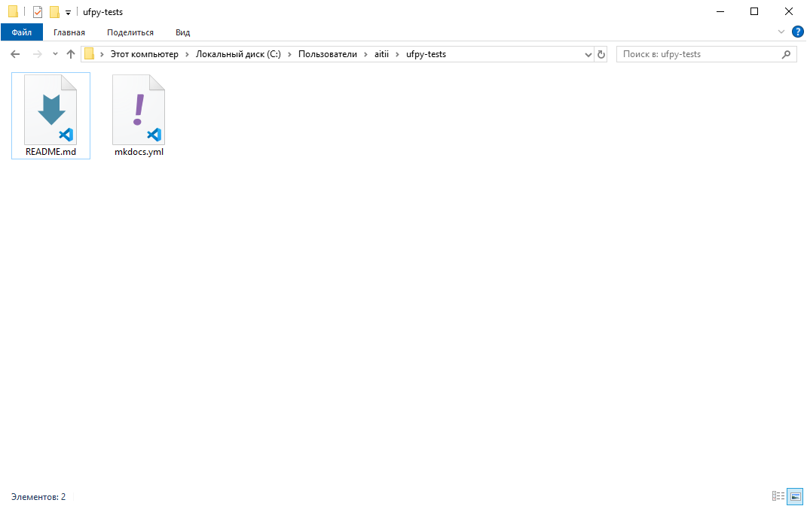
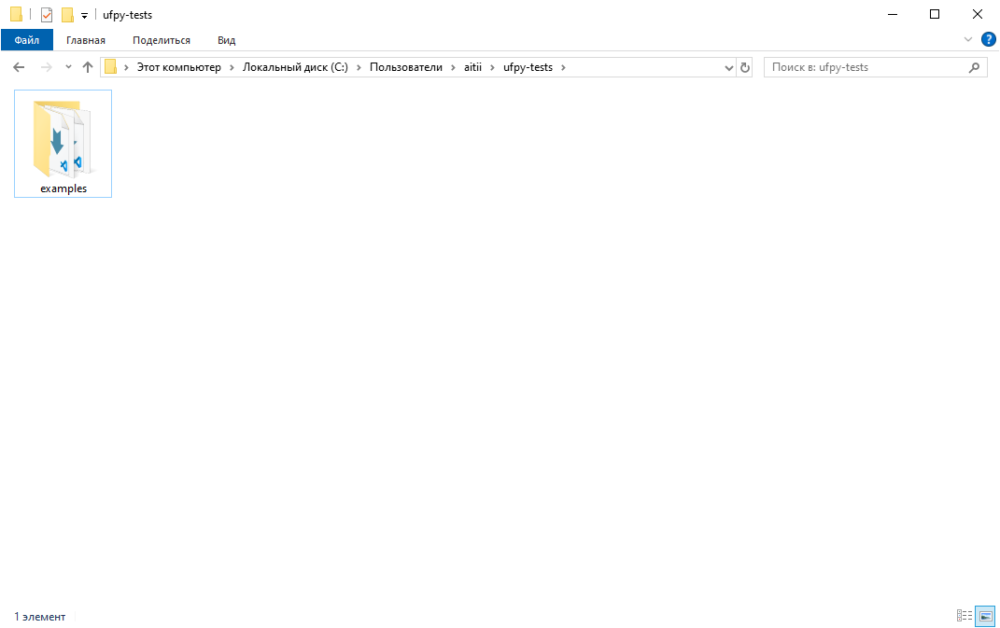
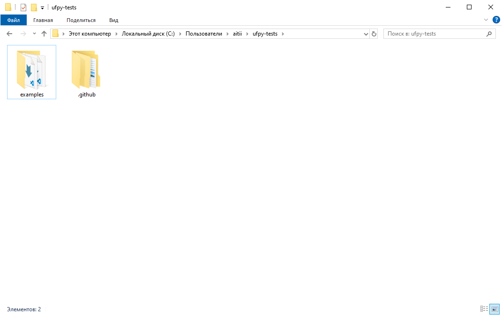
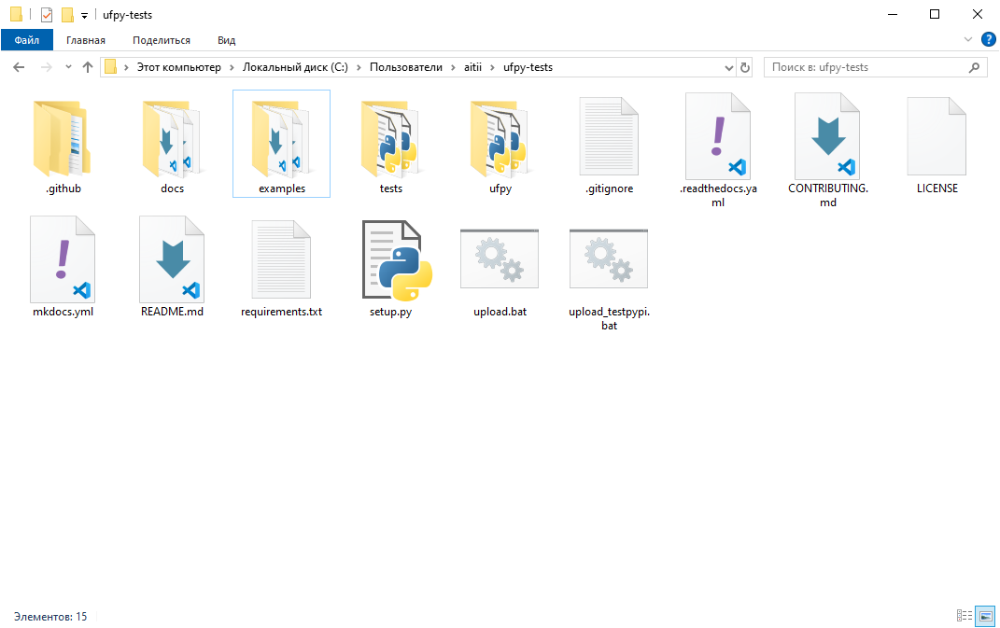

# Github / Download

## Introduction

In `ufpy` there are 3 functions and 1 class for downloading things from public GitHub repositories.
You can without GitHub token download all repository, folder or several folders, and file or several
files. You can use `UGithubDownloader` class for all this actions or other 3 functions. Class is more
optimized for multi-requesting. If you want to download anything several times: use it. He is using 1]
unpacked zip archive for all operations and by the end deletes it. If you don't want to download anything
several times -> use functions.

Import functions and class from `ufpy`:
```python
import ufpy
from ufpy import UGithubDownloader, download_file, download_folder, download_repo, UGithubDownloader
```

> [!CAUTION]
> All repositories you want to download from must be public

## Open `UGithubDownloader` class and use it

For opening this class you should use `with` operator as you do with files and other things:
```python
with UGithubDownloader("honey-team/ufpy", "C:/Ufpy-Test", "0.1") as gd:
    # First argument - "repository owner"/"repository name"
    # Second - Base download path (in all methods is using download paths from base download path. How in cmd
    # for example: base path: C:\; cd ufpy -> final path: C:\ufpy.) (default is cwd (current working directory)
    # Third argument: Branch or tag name (default is "main" (not master!))
    gd.download_repo() # In C:/Ufpy-Test will appear all files from 0.1 tag in this repository.
    gd.download_repo("ufpy-0.1") # In C:/Ufpy-Test/ufpy-0.1 will appear all files from 0.1 tag in this repository
```

## Download file(s)

You can use `download_file()` function, `ufpy.github.download.file()` function
(they're same, but with different names) and `UGithubDownloader.download_file()` method.

> [!NOTE]
> You can use any iterable of strings in `download_file()` function for downloading several files.
> In `UGithubDownloader` there are `download_files()` method.

One file:
```python
download_file("honey-team/ufpy", "README.md", "C:/Users/<name>/ufpy-tests")
# copy README.md from main branch in C:/Users/<name>/ufpy-tests directory

with UGithubDownloader("honey-team/ufpy", "C:/Users/<name>/ufpy-tests") as gd:
    gd.download_file("README.md") # Same
```

After changing `<name>` to your username and running this code you'll get this:


Two files:
```python
download_file("honey-team/ufpy", ["README.md", "mkdocs.yml"], "C:/Users/<name>/ufpy-tests")
# copy README.md and mkdocs.yml from main branch in C:/Users/<name>/ufpy-tests directory

with UGithubDownloader("honey-team/ufpy", "C:/Users/<name>/ufpy-tests") as gd:
    gd.download_files(["README.md", "mkdocs.yml"]) # Same
```

After changing `<name>` to your username and running this code you'll get this:


## Download folder(s)

You can use `download_folder()` function, `ufpy.github.download.folder()` function
(they're same, but with different names) and `UGithubDownloader.download_folder()` method.

> [!NOTE]
> You can use any iterable of strings in `download_folder()` function for downloading several folders.
> In `UGithubDownloader` there are `download_folders()` method.

One folder:
```python
download_folder("honey-team/ufpy", "examples", "C:/Users/<name>/ufpy-tests")
# create C:/Users/<name>/examples folder
# and copy origin/examples contents from main branch in this folder

with UGithubDownloader("honey-team/ufpy", "C:/Users/<name>/ufpy-tests") as gd:
    gd.download_folder("examples") # Same
```

After changing `<name>` to your username and running this code you'll get this:


Two folders:
```python
download_folder("honey-team/ufpy", ["examples", ".github"], "C:/Users/<name>/ufpy-tests")
# create C:/Users/<name>/examples and C:/Users/<name>/.github folders
# and copy origin/examples contents and origin/.github contents from main branch in this folders

with UGithubDownloader("honey-team/ufpy", "C:/Users/<name>/ufpy-tests") as gd:
    gd.download_folders(["examples", ".github"]) # Same
```

After changing `<name>` to your username and running this code you'll get this:


## Download all repository

You can use `download_repo()` function, `ufpy.github.download.repo()` function
(they're same, but with different names) and `UGithubDownloader.download_repo()` method:
```python
download_repo("honey-team/ufpy", "C:/Users/<name>/ufpy-tests")
# copy all repository files and folders with its contents from main branch in C:/Users/<name>/ufpy-tests directory.

with UGithubDownloader("honey-team/ufpy", "C:/Users/<name>/ufpy-tests") as gd:
    gd.download_repo() # Same
```

After changing `<name>` to your username and running this code you'll get this:

> [!NOTE]
> Repository code is code before merging this pull request (#37).
> When this pull request was merged, repository was changed.


